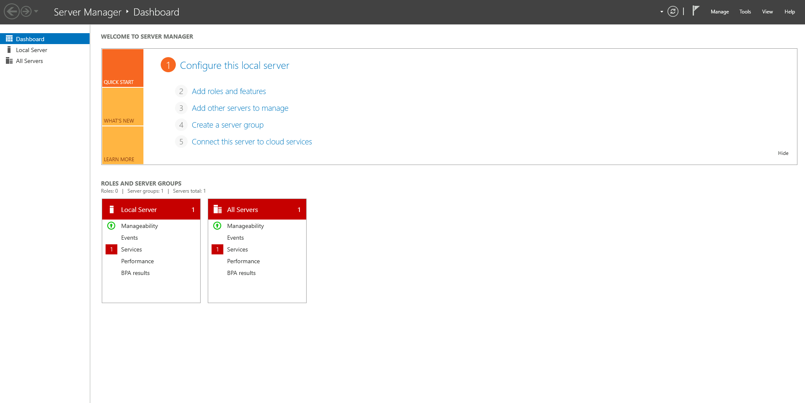
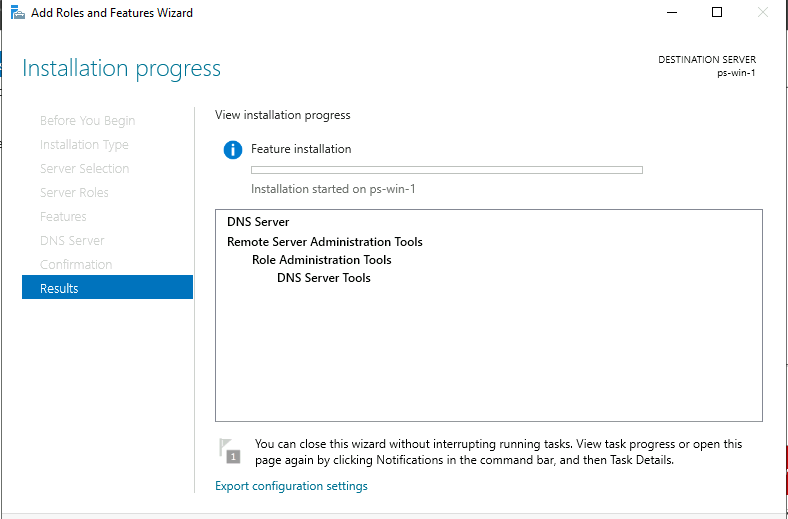
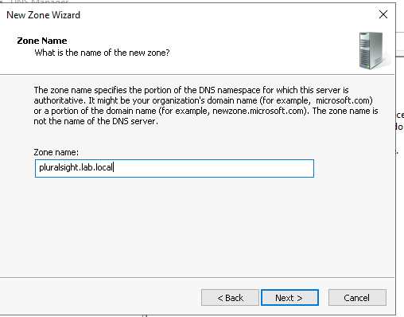
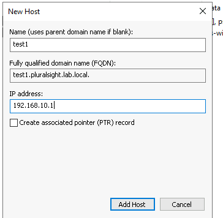
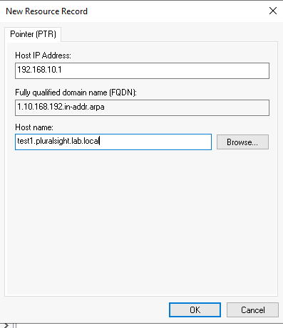
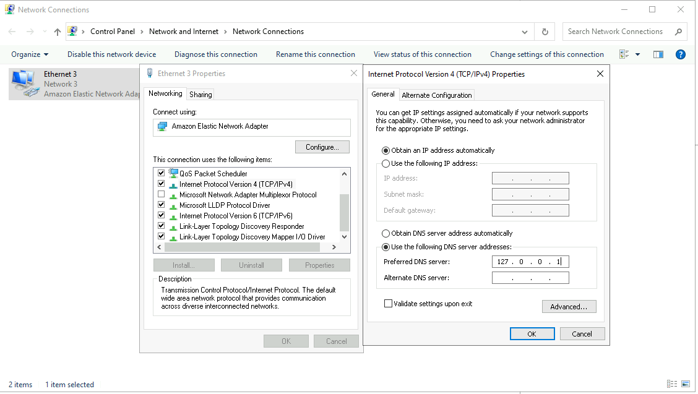
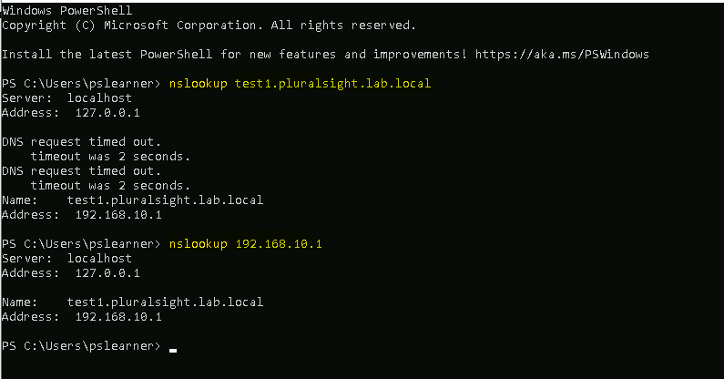

# 🧠 Windows DNS Server Configuration Project

## 📘 Overview

This project demonstrates the installation, configuration, and validation of a Domain Name System (DNS) server in a Windows Server environment. The implementation supports both **Forward Lookup Zones** and **Reverse Lookup Zones**, enabling hostname-to-IP and IP-to-hostname resolution. This configuration simulates core infrastructure typically deployed in enterprise network environments.

---

## 🎯 Project Objectives

- Deploy a functional Windows-based DNS server.
- Create and manage a primary **Forward Lookup Zone**.
- Configure and verify a **Reverse Lookup Zone** for PTR record resolution.
- Add DNS records (A and PTR) for internal host resolution.
- Point the local system to itself for DNS queries.
- Confirm bidirectional DNS resolution using `nslookup`.

---

## 🧱 Environment Details

| Component           | Value                           |
|---------------------|----------------------------------|
| OS                  | Windows Server 2019   |
| Static IP           | `172.31.24.15`          |
| DNS Install         |  Install                |
| DNS Zone Name       | `pluralsight.lab.local`|
| Host Record         | `test1` → `192.168.10.1`    |
| Reverse Zone        | `192.168.10.0` → PTR zone        |
| DNS Server Address  | `127.0.0.1`  |
| Test (nslookup)     | NsLookup 

---

## ⚙️ Implementation Summary

### ✅ DNS Role Installation

- Deployed the DNS Server role via **Server Manager**.
- Ensured the role and service were operational post-installation.

### ✅ Forward Lookup Zone

- Created a **Primary Zone** named `pluralsight.lab.local`.
- Added an **A Record** mapping `test1.pluralsight.lab.local` to `192.168.10.1`.

### ✅ Reverse Lookup Zone

- Configured a reverse zone for `192.168.10.0/24`.
- Added a **PTR Record** mapping `192.168.10.1` to `test1.pluralsight.lab.local`.

### ✅ Local DNS Binding

- Set the system's preferred DNS server to `127.0.0.1` (self).
- Verified the configuration using the **IPv4 properties** of the primary network interface.

### ✅ DNS Resolution Testing

Used `nslookup` to validate:

- **Forward Resolution**:
  ```powershell
  nslookup test1.pluralsight.lab.local
